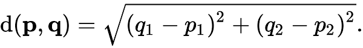

# Kmeans-processing-java-image-segmentation
Image Segmentation Using K-Means in Processing (Java)

Euclidean Distance:

This script segments images using K-means algorithm: 

* Declares input amount of centroids randomly.
* Calculates distance formula to each centroid and allocates closest colour to the pixel.
(N centroids means N colours !)

